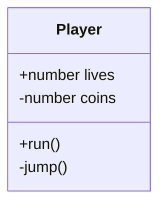
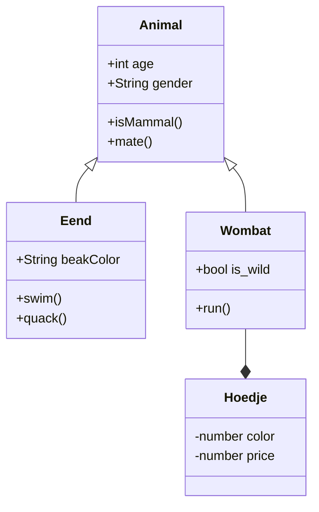

# Les 6 

- Encapsulation
- Wat is een klassendiagram
- Timers en spawning

<br><br><br>

## Encapsulation

Je classes hebben properties en methods. Deze kan je afschermen voor andere classes door ze `private` te maken. Dit helpt om je code overzichtelijker en veiliger te maken. Een `private` onderdeel kan nooit door andere classes aangepast worden.

In javascript kan je `private` properties aangeven met een `#` symbool. 

Als je vanuit een andere class toch een private waarde wil kunnen uitlezen, dan maak je daar een `get` functie voor, in dit voorbeeld zie je `getDetails()`.

```js
class Car {
  #brand;
  #mileage;

  constructor(brand) {
    this.#brand = brand;
    this.#mileage = 0; 
  }

  getDetails() {
    return `${this.#brand}, - ${this.#mileage} miles`;
  }

  drive() {
    this.#increaseMileage(10)
  }

  #increaseMileage(distance) {
    this.#mileage += distance;
  }
}
```

<br><br><br>

## Klassendiagram

Een klassendiagram is een visuele weergave van je project. Je kan OOP classes tekenen als blokjes, waarin je de methods en properties aangeeft. Met een `+` en `-` geef je aan of de properties en methods public of private zijn.



Tussen de classes teken je pijltjes die aangeven wat de relatie tussen de classes is:
- Een class *heeft* een andere class, dit is *composition*: *Een Wombat IS een Animal*.
- Een class *is* een subtype van een andere class, dit is *inheritance*: *Een Wombat HEEFT een Hoedje*.

<br>



Zie hier nog een [voorbeeld](../snippets/classdiagram.md)

<br>

### Opdracht

Teken een klassendiagram voor jouw game.

<br><br><br>

# Excalibur

## Spawning

Met spawning bedoelen we dat er tijdens de game nieuwe actors worden aangemaakt. 

Als een Actor schiet, dan spawned er een bullet in de game. De positie van die bullet is meestal de positie van de actor.

```js
export class Player extends Actor {
    shoot() {
        let b = new Bullet()
        b.pos = new Vector(this.pos.x, this.pos.y)
        this.scene.add(b)
    }
}
export class Bullet extends Actor {
    constructor() {
        super({ width: 10, height: 10 }) 
    }
}
```
> *Als de Player een child van een andere actor is, dan kan je ook via `this.globalPos.x, this.globalPos.y` de exacte positie in de wereld opvragen.*

Vergeet niet om gespawnde bullets ook weer uit de game te verwijderen

```js
export class Bullet extends Actor {
    onInitialize(engine) {
        this.events.on("exitviewport", () => this.kill());
    }
}
```
### Explosions

Als een bullet een vijand raakt kan je een explosie spawnen op die positie. De explosie verwijdert zichzelf na een fade-out.

```js
export class Explosion extends Actor {

     constructor(x, y) {
        super({x,y,width:100, height:100})
     }
     onPostUpdate(engine) {
        this.scale = this.scale.add(new Vector(0.06, 0.06))
        this.graphics.opacity -= 0.05
        if(this.graphics.opacity < 0.01) {
            this.kill()
        }
    }
}
```


<br><br><br>

## Timers

Je kan in Excalibur geen `setInterval` of `setTimeout` gebruiken omdat daarbij geen rekening met de gameloop wordt gehouden.

De simpelste oplossing hiervoor is om zelf een frame counter bij te houden. Elke keer dat er een N aantal frames is verstreken laat je iets gebeuren.

```js
export class Fish extends Actor {

    frameCounter

    constructor() {
        super({width:100,height:100})
        this.frameCounter = 0
    }

    onPostUpdate(engine) {
        this.frameCounter++
        if(this.frameCounter > 120) {
            console.log("2 seconden verstreken")
            this.frameCounter = 0
        }
    }
}
```

Je kan in excalibur een `delay` toevoegen voordat code wordt uitgevoerd:

```js
class Fish extends Actor {

    onInitialize(engine) {
        engine.clock.schedule(() => {
                console.log("this message shows after 2 seconds")
        }, 2000)
    }
}

```
