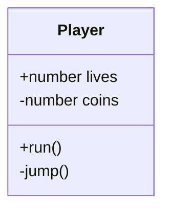
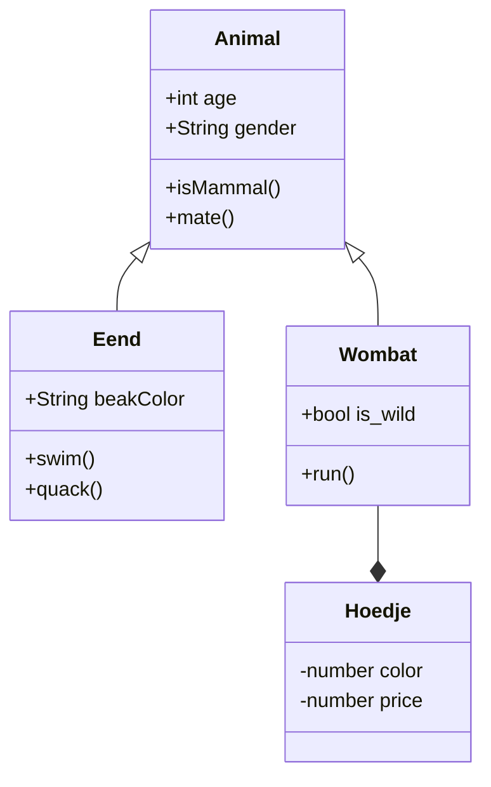

# Les 6 

- Encapsulation
- Wat is een klassendiagram
- Timers en spawning
- Enemy Behaviour

<br><br><br>

## Encapsulation

Je classes hebben properties en methods. Deze kan je afschermen voor andere classes door ze `private` te maken. Dit helpt om je code overzichtelijker en veiliger te maken. Een `private` onderdeel kan nooit door andere classes aangepast worden.

In javascript kan je `private` properties aangeven met een `#` symbool. 

Als je vanuit een andere class toch een private waarde wil kunnen uitlezen, dan maak je daar een `get` functie voor, in dit voorbeeld zie je `getDetails()`.

```js
class Car {
  #brand;
  #mileage;

  constructor(brand) {
    this.#brand = brand;
    this.#mileage = 0; 
  }

  getDetails() {
    return `${this.#brand}, - ${this.#mileage} miles`;
  }

  drive() {
    this.#increaseMileage(10)
  }

  #increaseMileage(distance) {
    this.#mileage += distance;
  }
}
```

<br><br><br>

## Klassendiagram

Een klassendiagram is een visuele weergave van je project. Je kan OOP classes tekenen als blokjes, waarin je de methods en properties aangeeft. Met een `+` en `-` geef je aan of de properties en methods public of private zijn.



Tussen de classes teken je pijltjes die aangeven wat de relatie tussen de classes is:
- Een class *heeft* een andere class, dit is *composition*: *Een Wombat IS een Animal*.
- Een class *is* een subtype van een andere class, dit is *inheritance*: *Een Wombat HEEFT een Hoedje*.

<br>



Zie hier nog een [voorbeeld](../snippets/classdiagram.md)

<br>

# Opdracht

Teken het klassendiagram voor jouw inleveropdracht. Als je hier nog niet aan was begonnen is dit een mooi moment!

- Bedenk welke classes er zijn in je game
- Geef de classes "eigenschappen en gedrag"
- Bedenk of die public of private zijn
- Teken lijntjes tussen de classes voor composition en inheritance.

<br><br><br>

## Spawning

Met spawning bedoelen we dat er tijdens de game nieuwe actors worden aangemaakt. Als je schiet dan spawned er een bullet. Meestal geef je de `x,y` waarden mee, dat is waar de bullet moet verschijnen:

```js
export class ShooterGame extends Game {
    spawnBullet(x, y) {
        this.add(new Bullet(x, y))
    }
}
export class Bullet extends Actor {
    constructor(x, y) {
        super({ x, y, width: 10, height: 10 }) 
    }
}
```

## Timers

Je kan geen `setInterval` of `setTimeout` gebruiken omdat daarbij geen rekening met de gameloop wordt gehouden. In een actor kan je via een frame counter een bepaalde actie elke X seconden laten gebeuren:

```js
class Game extends Engine {

   counter

  startGame() {
      this.counter = 0
  }

  onPostUpdate() {
        this.counter++
        if(this.counter > 120) {
            this.add(new Enemy())
            this.counter = 0
        }
  }
}
```

Excalibur heeft ook een `Timer` class, deze moet je toevoegen aan de `Game` (of `Scene`). Dat zorgt dat de Timer synchroon loopt met je gameloop framerate.  Om bij de huidige game te komen vanuit een `Actor` kan je `this.scene.engine` gebruiken. Om bij de huidige scene te komen vanuit een `Actor` kan je `this.scene` gebruiken.

```js
export class Game extends Engine {
    startGame() {
        this.timer = new Timer({
            fcn: () => this.spawn(),
            interval: 800,
            repeats: true
        })
        this.add(this.timer)
        this.timer.start()
    }

    spawn() {
        this.add(new Ball())
    }
}
```

- [Zie Excalibur Timers](https://excaliburjs.com/docs/timers)

<br><br><br>

## Enemy behaviour

Een vector kan je gebruiken als richting. X en Y zijn dan een getal tussen 0 en 1.
`let direction = new Vector( 1, 0.7 )`

Om met een snelheid in die richting te bewegen kan je scale toepassen:
`this.vel = direction.scale(200)`

Het verschil tussen twee vectoren kan je "normalizen" (omzetten naar richting).
Nu kan je Luigi altijd achter Mario aan laten lopen!

```js
class Game extends Engine {
    
    mario
    luigi

    onInitialize(engine){
        this.mario = new Mario()
        this.luigi = new Luigi()
        this.add(this.mario)
        this.add(this.luigi)
    }

    onPostUpdate() {
        let direction = this.mario.pos.sub(this.luigi.pos).normalize()
        this.luigi.vel = direction.scale(200)
    }
}
```
Je kan via `distance` de afstand tussen de speler en een vijand opvragen. In dit voorbeeld rent de enemy weg als de speler te dicht in de buurt komt:

```js
class Enemy extends Actor {
    onInitialize(engine){
        this.pos = new Vector(500, 40)
        this.vel = new Vector(0,0)
    }
    onPreUpdate(engine){
        const distance = Vector.distance(engine.player.pos, this.pos)
        if(distance < 200) {
            let direction = this.sub(engine.player.pos).normalize()
            this.vel = direction.negate().scale(200)
        }
    }
}
```
