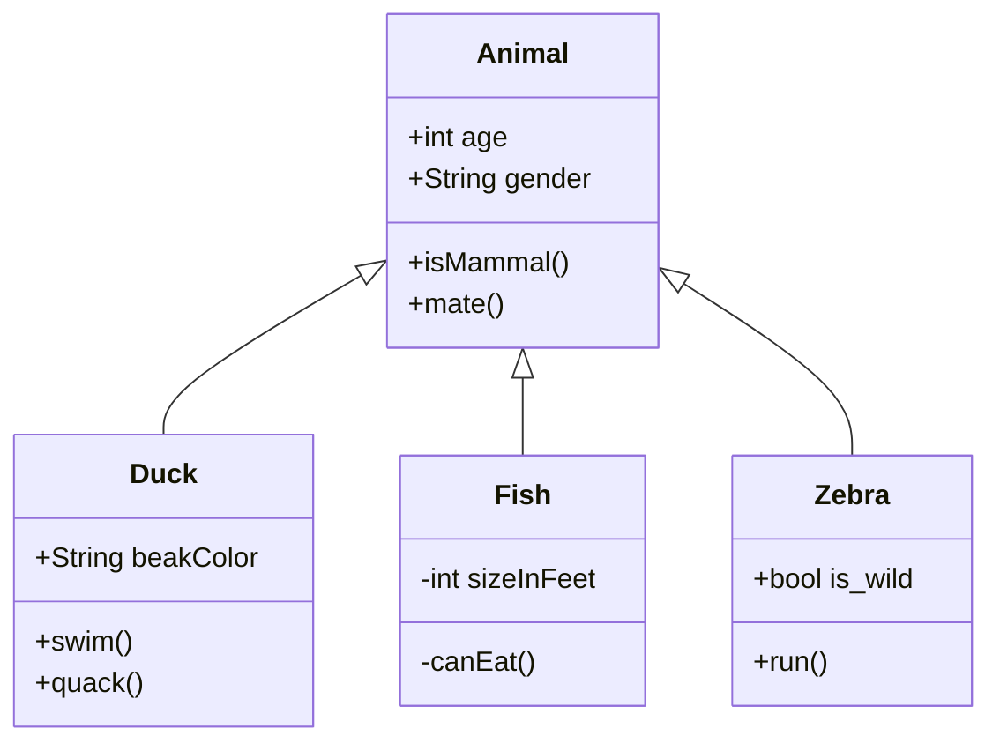

# Les 6 

- Encapsulation
- Wat is een klassendiagram
- Timers en spawning

<br><br><br>

## Encapsulation

Je classes hebben properties zoals age, coins, lives, etc. Deze properties kan je afschermen voor andere classes door ze `private` te maken. Dit helpt om je code overzichtelijker en veiliger te maken. Een `private` property kan nooit door andere classes aangepast worden.

In javascript kan je `private` properties aangeven met een `#` symbool. 

```js
class Cat {
    
    #name 
    score

    constructor() {
        this.score = 10
        console.log(tihs.score)

        this.#name = "Chonkers"
        console.log(this.#name)
    }
}
```

<br><br><br>

## Klassendiagram

Een klassendiagram is een visuele weergave van je project. Je kan OOP classes tekenen als blokjes, waarin je de methods en properties aangeeft. Met een `+` en `-` geef je aan of de properties en methods public of private zijn.


Tussen de classes teken je pijltjes die aangeven wat de relatie tussen de classes is:
- Een class *heeft* een andere class : dit is *composition*
- Een class *is* een subtype van een andere class : dit is *inheritance*

<br>



<br>

### Opdracht

Teken een klassendiagram voor jouw game.

<br><br><br>

## Spawning en Timers

Met spawning bedoelen we dat er tijdens de game nieuwe actors worden aangemaakt. Als je schiet dan spawned er een bullet. Meestal geef je de `x,y` waarden mee, dat is waar de bullet moet verschijnen:

```js
export class ShooterGame extends Game {
    spawnBullet(x, y) {
        this.add(new Bullet(x, y))
    }
}
export class Bullet extends Actor {
    constructor(x, y) {
        super({ x, y, width: 10, height: 10 }) 
    }
}
```

Een `Timer` moet je toevoegen aan de `Game` (of `Scene`). Dat zorgt dat de Timer synchroon loopt met je gameloop framerate. Je kan geen `setInterval` of `setTimeout` gebruiken omdat daarbij geen rekening met de gameloop wordt gehouden.

> *🚨 Als je objecten spawned, moet je opletten dat die objecten aan de huidige game/scene worden toegevoegd!*

Om bij de huidige game te komen vanuit een `Actor` kan je `this.scene.engine` gebruiken. Om bij de huidige scene te komen vanuit een `Actor` kan je `this.scene` gebruiken.

```js
export class Game extends Engine {
    startGame() {
        this.timer = new Timer({
            fcn: () => this.spawn(),
            interval: 800,
            repeats: true
        })
        this.add(this.timer)
        this.timer.start()
    }

    spawn() {
        this.add(new Ball())
    }
}
```

- [Zie Excalibur Timers](https://excaliburjs.com/docs/timers)