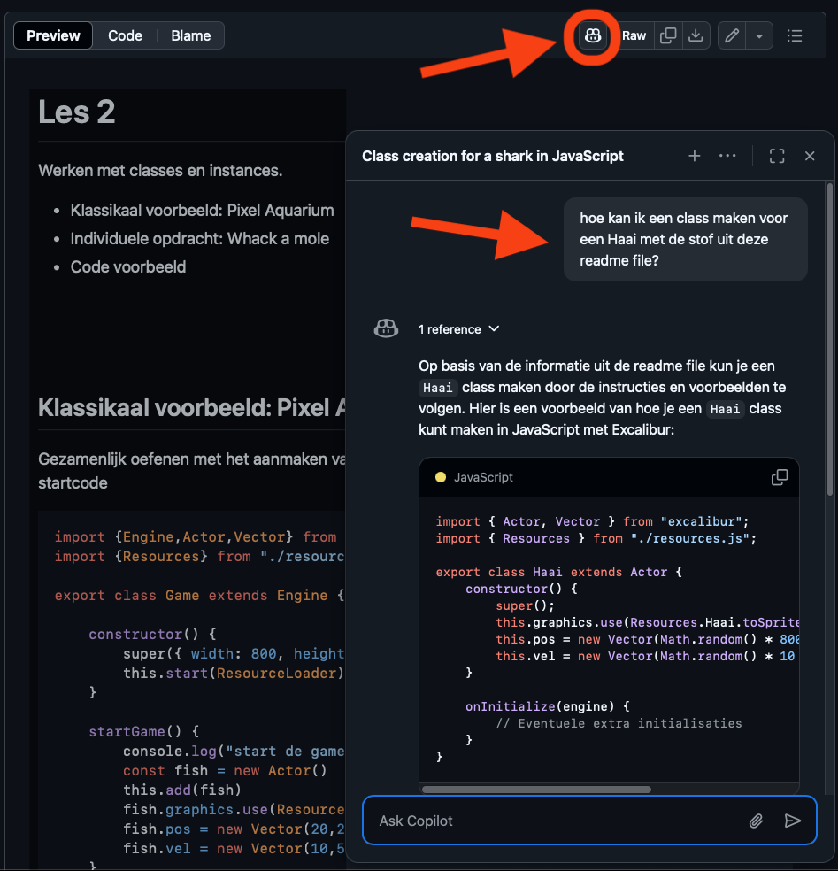
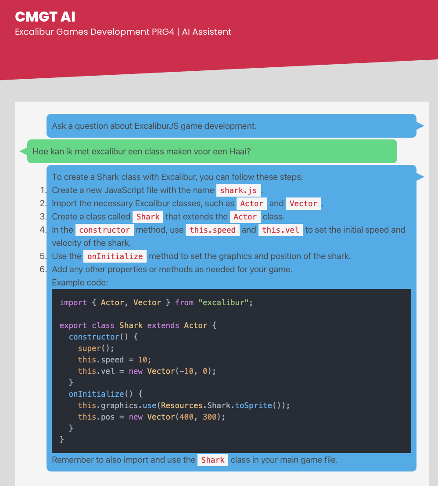

# Hulp vragen aan AI

- [Prompting](#prompting)
- [Resultaat evalueren](#resultaat-evalueren)
- [Prompt Instructions in VS Code](#prompting)
- [Chat met Github Repositories](#chat-met-de-repository)
- [CMGT chatbot](#cmgt-chatbot)

<br><br><br>

## Prompting

Bij het doen van een prompt in ChatGPT, Claude, Blackbox, etc. over Excalibur moet je goede instructies meegeven, omdat het antwoord anders niet voldoende overeenkomt met de werkwijze uit de lessen.

Voordat je gaat prompten, kan je deze minimale instructies sturen:

```
I am using the excaliburjs library at https://github.com/excaliburjs/Excalibur and object oriented programming, to create a game.
Please use the following code examples to format classes in the game. I use vite to test and build the game. I do not use the global "ex." namespace for excalibur.

import {Engine,Actor,Vector} from "excalibur";
import {Resources} from "./resources.js";
import {Player} from "./player.js";
import {Enemy} from "./enemy.js";

export class Game extends Engine {
    enemy
    player
    startGame() {
        this.player = new Player()
        this.add(this.player)
        
        this.enemy = new Enemy()
        this.add(this.enemy)
    }
}

export class Enemy extends Actor {
    constructor(){
        super({width:100, height:100})
        this.pos = new Vector(100,100)
        this.vel = new Vector(5,0)
    }
}
```

<br><br><br>

## Resultaat evalueren

Check altijd of het resultaat van je prompt overeenkomt met de instructies. 

🚨 *Hieronder zie je een voorbeeld van Excalibur code die niet overeenkomt met de lessen, omdat er geen instructies zijn meegegeven*

```js
const engine = new ex.Engine({
  width: 600,
  height: 400,
});

const actor1 = new ex.Actor({ width: 50, height: 50 });
engine.add(actor1);
```

<br><br><br>

## Prompt Instructions in VS Code

Je kan in je code editor automatisch prompt instructies meegeven:

- Zet Copilot aan (gratis in VS Code)
- Zet de "instructions" optie aan *(settings > copilot > instructions > use .copilot-review-instructions.md file)*
- Plaats [deze instructions file](./snippets/.copilot-review-instructions.md) in de root van je project.


<br><br><br>

## Chat met Github Repositories

Je kan in [de PRG4 repository](https://github.com/HR-CMGT/PRG04-2024-2025/) en in de officiele [Excalibur Repository](https://github.com/excaliburjs/Excalibur) op het ***copilot*** icoontje klikken om een chatvenster te openen. Je kan dan specifieke vragen over de repository stellen. 

> ⚠️ *Let op dat je hier nog steeds instructies moet meegeven, minimaal dat je met Object Oriented Programming classes werkt, zonder de "ex." namespace.*



<br><br><br>

## CMGT Chatbot

De [CMGT chatbot](https://ai-assistent-mu.vercel.app) heeft de instructies over de lesstof al ingebouwd.



https://ai-assistent-mu.vercel.app

<br><br><br>

